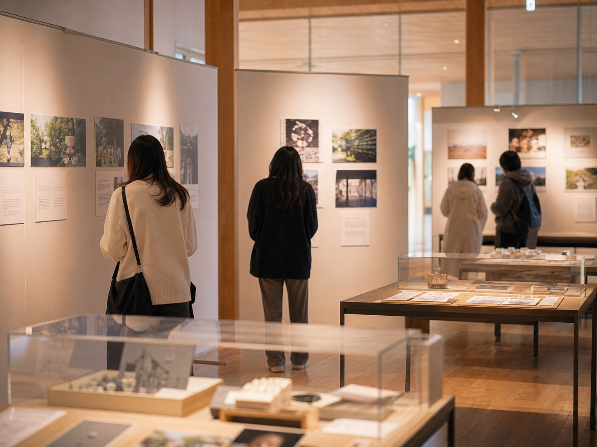

# Imagine Deck 背景画像 生成プロンプト集

> 対象: Imagine Deck 公式サイト（愛媛大学ミュージアム交流スペース）
> 目的: 全セクション・全カードの背景画像を AI で生成するための仕様書
> 作成日: 2026-05-10

---

## 0. このドキュメントの使い方

1. **各画像 1 枚ずつ生成する** — まとめて作らない（用途が違うため）
2. プロンプトは **英語版（メイン）+ 日本語版（参考）** の両方を記載。Midjourney / DALL·E 3 / Stable Diffusion / Imagen どれでも使えるよう、汎用的な英語に揃えてある
3. ファイル名・配置先を **そのまま** 守れば、CSS 側の差し替えだけで反映できる（§5 参照）
4. 生成後は §6 の **後処理ガイド** に従って軽く調整する（暗度・トリミング等）
5. 全画像生成後、§7 の **チェックリスト**を埋めて完成

---

## 1. ブランド方針（全画像共通）

### 1.1 世界観

Imagine Deck は **愛媛大学ミュージアム** の中に新設された **「知的交流のハブ」**。
4 つのコア機能（オープンスペース／ショーケース／ワークショップ＆スタートアップ支援／インタラクティブ体験）を担い、「**見る・触れる・考える・対話する**」体験を提供する。

画像は次のような **温度感** を持つこと:

- **静謐** だが **温かい**（ミュージアムの落ち着き × 学生の活気）
- **知的** だが **威圧的でない**（敷居が低い、誰でも入れる）
- **現代的** だが **懐かしい**（建物の歴史性 × デジタル展示）
- **多様性** が感じられる（学生・教員・地域住民・社会人大学院生・子供）

### 1.2 カラーパレット

```
Primary purple:    #8b168f     (ブランド主色)
Primary dark:      #6f1173
Primary light:     #f7e8f8
Accent orange:     #f4a93a     (有料・準備中のスタンプ由来)
Background beige:  #f7f7f4
Surface white:     #ffffff
Text dark:         #171717
```

画像中の支配色は **紫系・ベージュ・暖色系木目・自然光** を基調とする。鮮やかすぎる原色は避ける。

### 1.3 必ず避けるべき表現

- 派手なネオン色、極端な彩度
- 特定の人物が大写しになる構図（ストックフォト感が出る）
- 顔がはっきり認識できる人物（プライバシー・固有性回避）
- 海外のミュージアム特有の建築（パルテノン風列柱、欧州の宮殿天井等）
- AI 特有の不自然な指・歪んだ文字・破綻したパース
- 商業ロゴ・実在ブランド・実在大学のロゴ
- 暗すぎる／重すぎる雰囲気（葬式のような）
- アニメ調・カートゥーン調（ブランドに合わない）

### 1.4 推奨スタイル（共通プロンプト断片）

英語版で全プロンプトに含める:

```
photorealistic, soft natural daylight, warm museum atmosphere,
muted color palette dominated by purple #8b168f and warm beige tones,
shallow depth of field, cinematic composition, editorial photography style,
no visible text or logos, no faces clearly visible (only silhouettes / back views / blurred),
contemporary Japanese university museum interior aesthetic,
8k, high detail, professional architectural photography
```

ネガティブプロンプト共通:

```
neon colors, oversaturated, anime, cartoon, 3d render look, low quality,
distorted hands, distorted faces, watermark, signature, text, logos,
crowded, cluttered, dark gloomy mood, vintage sepia, fisheye lens
```

---

## 2. ファイル構成・命名規則

すべて `assets/images/` 配下に配置する。

```
assets/images/
├─ hero/
│  ├─ home-hero.jpg              ← トップページ Hero メインビジュアル
│  ├─ home-hero-visual.jpg       ← Hero 右側の縦長ビジュアル
│  ├─ page-hero-reserve.jpg      ← 予約ページ ヘッダー帯
│  ├─ page-hero-guidelines.jpg   ← ガイドライン ヘッダー帯
│  ├─ page-hero-calendar.jpg     ← カレンダー ヘッダー帯
│  └─ page-hero-eventlog.jpg     ← 開催ログ ヘッダー帯
├─ section/
│  ├─ about-side.jpg             ← About セクション右側ビジュアル
│  ├─ flow-bg.jpg                ← 利用の流れ セクション背景
│  ├─ stats-bg.jpg               ← 数字で見る セクション背景
│  ├─ cta-banner.jpg             ← 予約 CTA バナー背景
│  ├─ guidelines-hint-bg.jpg     ← トップ「3 区分」セクション背景
│  ├─ rules-bg.jpg               ← ガイドラインルール背景
│  └─ mission-bg.jpg             ← 目的とコンセプト背景
├─ feature/
│  ├─ feature-01-openspace.jpg   ← オープンスペース機能カード
│  ├─ feature-02-showcase.jpg    ← ショーケース機能カード
│  ├─ feature-03-workshop.jpg    ← ワークショップ＆スタートアップ
│  └─ feature-04-interactive.jpg ← インタラクティブ体験
├─ event/
│  ├─ event-01-mymuseum.jpg      ← 「私のミュージアム」展
│  ├─ event-02-3dprinter.jpg     ← 3D プリンタ WS
│  ├─ event-03-publictalk.jpg    ← 公開トーク
│  ├─ event-04-newyear.jpg       ← 新年顔合わせ
│  ├─ event-05-bookbinding.jpg   ← 古典装幀展
│  └─ event-06-picturebook.jpg   ← 絵本朗読
├─ flow/
│  ├─ flow-01-reserve.jpg        ← Step 01: 予約する
│  ├─ flow-02-use.jpg            ← Step 02: 当日利用する
│  └─ flow-03-record.jpg         ← Step 03: 振り返り・記録
└─ texture/
   ├─ paper-texture.jpg          ← 全体ベース紙質テクスチャ（任意）
   └─ purple-grain.jpg           ← 紫グラデのノイズ素材（任意）
```

**合計: 必須 25 枚 + テクスチャ 2 枚（任意）**

---

## 3. ページ別 画像仕様

各画像について:

- **配置先 (CSS)** = どのセレクタの背景になるか
- **アスペクト比 / 推奨ピクセル**
- **構図メモ**
- **英語プロンプト**（生成用メイン）
- **日本語プロンプト**（人間確認用）
- **後処理**

---

### 3.1 トップページ (`index.html`)

#### IMG-01 `home-hero.jpg` — Hero 全体背景

- **配置先**: `.p-hero` の background（現状の紫グラデーションを置換／重ねる）
- **アスペクト比**: 16:9〜21:9
- **推奨サイズ**: 2880 × 1620 px（モバイル時はトリミング上下中央維持）
- **役割**: サイト訪問者が最初に目にする「世界観の宣言」

**構図メモ**:
紫を基調にした抽象的かつ建築的な背景。中央〜下部にミュージアム展示室の入口らしきパース、上部に柔らかな自然光の差し込み。具体的すぎる物体は避け、雰囲気主体。

**英語プロンプト**:
```
A wide cinematic interior view of a contemporary Japanese university museum
exchange space, soft purple gradient lighting bathing white walls,
warm wooden floor in foreground, abstract minimalist architecture,
gentle daylight streaming from skylight on the right,
faint silhouettes of two visitors in the deep background (out of focus),
deep purple #6f1173 to lighter lavender tones, accent of warm orange
sunlight on left wall, atmospheric, editorial architectural photography,
high ceiling, museum-like calm with hint of student activity,
8k, photorealistic, shallow depth of field
```

**日本語**:
> 現代的な日本の大学ミュージアム交流スペースのワイドな室内ビュー。柔らかな紫グラデーションの光が白い壁に注ぎ、手前は暖かい木目フロア。右奥のトップライトから自然光、奥に来館者 2 名のシルエット（ピントは外す）。深い紫から淡いラベンダーへのグラデーション、左壁にオレンジの差し色。静謐で学生の気配が漂う美術館の雰囲気。

**後処理**:
- 中央〜下部を 30% 暗くする（テキストの可読性確保）
- 全体に紫 #6f1173 のオーバーレイ 25%
- 右上 20% にオレンジ #f4a93a 放射光を残す

---

#### IMG-02 `home-hero-visual.jpg` — Hero 右側縦長ビジュアル

- **配置先**: `.p-hero__visual` の中身（現在の自作猫ビジュアルを置換）
- **アスペクト比**: 4:5 縦長
- **推奨サイズ**: 1200 × 1500 px

**構図メモ**:
ミュージアム内の一角を縦構図で。中央に展示ガラスケース or 大きな本、奥にぼんやりと猫のシルエットが 3 匹並んで日向ぼっこをしている（重要：愛媛大ミュージアムの猫モチーフ由来）。手前に柔らかい紫のドレープ。

**英語プロンプト**:
```
Vertical museum interior portrait, three calico/tabby/grey cats sitting peacefully
in a row on a wooden bench in the soft golden afternoon sun,
warm purple gradient ambient light, blurred display case background,
serene Japanese university museum exchange space atmosphere,
warm wood tones meeting purple shadow, "ただいま準備中" feeling
(work-in-progress charm), no people visible, no text,
photorealistic, editorial, cinematic, 4:5 portrait, 8k
```

**日本語**:
> 縦構図のミュージアム室内ポートレート。木製ベンチに 3 匹の猫（キジトラ・茶トラ・グレー）が一列に並び、午後の柔らかな黄金色の光に照らされている。背景に展示ケースをぼかして配置、紫グラデーションの環境光。「ただいま準備中」の温度感。人物なし・文字なし。

**後処理**:
- 上下に紫から白へのフェード追加（テキスト用）
- 右上に「ただいま準備中」スタンプを後から重ねる（CSS 側で）

---

#### IMG-03 `about-side.jpg` — About セクション右側

- **配置先**: `.p-about__media` の背景画像
- **アスペクト比**: 4:3
- **推奨サイズ**: 1600 × 1200 px

**構図メモ**:
「見る・触れる・考える・対話する」の象徴。複数人が机を囲んで何かに没頭している抽象的な俯瞰／斜め俯瞰。手だけが映る、触れている小さな展示物（標本／プロトタイプ／3D 出力物）。

**英語プロンプト**:
```
Top-down editorial view of a wooden table in a museum exchange space,
multiple hands of diverse ages reaching toward small artifacts —
a 3d-printed object, an open book, a glass specimen jar, a tablet showing
a research diagram — soft purple ambient light, warm wood grain,
no faces, only hands and forearms, sense of curiosity and dialogue,
warm beige and purple palette, editorial photography, shallow DoF, 4:3
```

**日本語**:
> ミュージアム交流スペースの木製テーブルを上から見たエディトリアルビュー。多様な年代の複数の手が、3D プリント造形物、開かれた本、ガラス標本瓶、研究図を映すタブレットに伸びている。柔らかな紫の環境光、暖かい木目。顔は映さず手と前腕のみ。好奇心と対話の気配。ベージュ＋紫。

---

#### IMG-04 `feature-01-openspace.jpg` — オープンスペース機能カード背景

- **配置先**: `.c-feature` の 1 枚目（オープンスペース機能）に `background-image`
- **アスペクト比**: 3:2
- **推奨サイズ**: 1200 × 800 px
- **支配色**: 紫系
- **不透明度**: CSS で 15% にフェード

**英語プロンプト**:
```
Wide-angle photograph of an open commons-style university museum space,
scattered groups of people (silhouettes only) studying alone or talking quietly
at low tables and bean-bag-like seating, late afternoon purple-tinted natural light,
warm wooden floor, glass partitions, sense of casual coexistence,
contemporary Japanese architecture, no faces visible, editorial style, 3:2
```

**日本語**:
> 大学ミュージアムのオープンコモンズの広角写真。低いテーブルやビーズクッション風の座席で、複数のグループ（シルエットのみ）が単独で勉強したり静かに会話している。午後遅くの紫がかった自然光、暖かい木目フロア、ガラスパーティション。日常的な共存感。

---

#### IMG-05 `feature-02-showcase.jpg` — ショーケース機能カード背景

- **配置先**: `.c-feature` 2 枚目
- **アスペクト比**: 3:2
- **推奨サイズ**: 1200 × 800 px
- **支配色**: 緑がかった紫（ハーバルトーン）

**英語プロンプト**:
```
Modern museum showcase display: glowing acrylic vitrines containing
research prototypes — a circuit board, a tiny robotic mechanism, a sample of
material science specimen, a holographic projection of a graph —
moody purple-green ambient lighting, sleek black exhibition pedestals,
rear-projected animation softly visible, contemporary Japanese university museum,
editorial photography, no people, 3:2
```

**日本語**:
> モダンなミュージアムのショーケース展示。研究プロトタイプ（回路基板／小型ロボット機構／材料科学標本／グラフのホログラフィック投影）が透明アクリルケースに展示され内側から光る。紫＋グリーンのムーディーな環境光、洗練された黒い展示台、背景のリアプロジェクションがほのかに見える。人物なし。

---

#### IMG-06 `feature-03-workshop.jpg` — WS & スタートアップ支援カード背景

- **配置先**: `.c-feature` 3 枚目
- **アスペクト比**: 3:2
- **推奨サイズ**: 1200 × 800 px
- **支配色**: 紫＋オレンジのアクセント

**英語プロンプト**:
```
Energetic workshop scene in a university museum space — a long table covered
with sticky notes, prototype sketches, cardboard models, laptops, coffee cups,
hands of multiple students working collaboratively (no faces),
warm orange and purple lighting mix, sense of startup energy meeting academic depth,
editorial photo, contemporary Japanese aesthetic, 3:2, shallow depth of field
```

**日本語**:
> 大学ミュージアム内の活気あるワークショップ風景。長テーブルに付箋、プロトタイプスケッチ、ダンボールモデル、ノート PC、コーヒーカップが散らばり、学生たちの手（顔は映らず）が協働している。暖かいオレンジと紫の混合照明、スタートアップのエネルギーと学術的深みが交差する空気感。

---

#### IMG-07 `feature-04-interactive.jpg` — インタラクティブ体験カード背景

- **配置先**: `.c-feature` 4 枚目
- **アスペクト比**: 3:2
- **推奨サイズ**: 1200 × 800 px
- **支配色**: 鮮やかすぎない紫＋暖色

**英語プロンプト**:
```
Hands-on interactive museum exhibit: a child's small hand and an adult hand
reaching toward a translucent touchscreen showing an abstract data visualization,
warm purple bloom lighting, blurred wooden environment, sense of wonder and
intergenerational dialogue, "see touch think dialogue" theme,
editorial museum photography, shallow DoF, no faces, 3:2
```

**日本語**:
> ハンズオンのインタラクティブ展示。子供の小さな手と大人の手が、抽象的なデータ可視化を映す半透明タッチスクリーンに伸びている。暖かい紫のブルーム照明、ぼかした木質環境、驚きと世代間対話の気配。「見る・触れる・考える・対話する」テーマ。顔なし。

---

#### IMG-08 `flow-01-reserve.jpg` — 利用の流れ Step 01

- **配置先**: `.p-flow__step:nth-child(1)` の右下背景（薄く `opacity: 0.15`）
- **アスペクト比**: 1:1
- **推奨サイズ**: 800 × 800 px

**英語プロンプト**:
```
Minimal illustration-style photo: a single hand holding a smartphone displaying
a calendar interface with a highlighted date, soft purple background,
clean Japanese editorial product photography, square 1:1, no faces, no text on screen
```

**日本語**:
> ミニマルなイラスト調写真。日付がハイライトされたカレンダー UI を表示するスマホを片手で持つ。柔らかな紫背景、清潔感のあるエディトリアル製品写真、1:1。画面に文字なし、顔なし。

---

#### IMG-09 `flow-02-use.jpg` — 利用の流れ Step 02

- **配置先**: `.p-flow__step:nth-child(2)` 右下背景
- **アスペクト比**: 1:1, 800 × 800 px

**英語プロンプト**:
```
Square minimal photo: a sealed travel mug placed on a wooden table next to
an open notebook, warm sunlight, soft purple ambient light, museum window
in soft focus background, no people, "drinks ok food no" feeling, editorial
```

---

#### IMG-10 `flow-03-record.jpg` — 利用の流れ Step 03

- **配置先**: `.p-flow__step:nth-child(3)` 右下背景
- **アスペクト比**: 1:1, 800 × 800 px

**英語プロンプト**:
```
Square minimal photo: a polaroid-like photograph and printed event report
laid on a wooden surface, warm purple lighting, archive feeling, museum
documentation aesthetic, no faces, editorial
```

---

#### IMG-11 `stats-bg.jpg` — 数字で見るセクション背景

- **配置先**: 該当 `.l-section` の `background-image`（`opacity` 経由で 8% に）
- **アスペクト比**: 21:9（パノラマ）
- **推奨サイズ**: 2400 × 900 px

**英語プロンプト**:
```
Ultra-wide panoramic abstract: faint architectural blueprint lines of a museum
floor plan dissolving into purple gradient wash, very subtle, almost monochromatic,
suitable as a low-opacity background, no clear focal point, 21:9
```

---

#### IMG-12 `cta-banner.jpg` — 予約 CTA バナー背景

- **配置先**: `.p-cta-banner` の `background-image`（既存の紫グラデ上にブレンド）
- **アスペクト比**: 16:6 ワイド
- **推奨サイズ**: 2400 × 900 px

**英語プロンプト**:
```
Wide cinematic photo of a museum corridor with deep purple wall on left and
warm golden afternoon light streaming from right, suggestive of "starting
something new", architectural elegance, no people, no text,
mood: anticipation and welcome, 16:6 panoramic, editorial
```

---

#### IMG-13 `latest-events-bg.jpg` — 最近のイベント セクション背景（任意）

- **配置先**: `#latest` セクション全体に `background: linear-gradient(...) , url(...)` で重ねる
- **アスペクト比**: 16:9
- **推奨サイズ**: 2400 × 1350 px、不透明度 6%

**英語プロンプト**:
```
Faded background texture: rows of soft circular event-photo frames blurred
into warm beige paper, museum archive aesthetic, almost imperceptible,
top-down or isometric, editorial 16:9
```

---

#### IMG-14 `guidelines-hint-bg.jpg` — トップ 3 区分セクション背景

- **配置先**: トップの「利用形態は 3 区分」セクション
- **アスペクト比**: 16:9
- **推奨サイズ**: 2400 × 1350 px、`opacity: 0.10`

**英語プロンプト**:
```
Subtle background: a wooden museum desk with three folded paper cards placed
side by side, each labeled with a different soft pastel — purple, green, orange —
suggesting three categories of users, top-down view, soft daylight,
no text, no people, editorial 16:9
```

---

### 3.2 予約ページ (`reserve.html`)

#### IMG-15 `page-hero-reserve.jpg` — 予約ページ ヘッダー帯

- **配置先**: `reserve.html` の `.l-page-hero` の `background-image`（紫グラデ上に重ねる）
- **アスペクト比**: 21:9（横長帯）
- **推奨サイズ**: 2400 × 1000 px
- **後処理**: 全体に紫 #6f1173 オーバーレイ 60%

**英語プロンプト**:
```
Wide horizontal banner: a calm museum reception desk in soft focus, warm purple
ambient light, an open guestbook on the desk, fountain pen lying nearby,
sense of "ready to begin", contemporary Japanese university museum interior,
no people, no text, 21:9 ultra-wide
```

**日本語**:
> 横長バナー。ぼかしの効いたミュージアム受付デスク、暖かい紫の環境光、デスクの上に開かれた来館記名帳と万年筆。「これから始まる」感じ。現代的な日本の大学ミュージアム室内。21:9。

---

#### IMG-16 `reserve-aside-bg.jpg` — 予約ページ サイドバーカード背景（任意）

- **配置先**: `.p-reserve-aside-card` の `background-image`（薄く）
- **アスペクト比**: 4:5
- **推奨サイズ**: 600 × 750 px、`opacity: 0.08`

**英語プロンプト**:
```
Vertical subtle background: a stack of light purple memo cards on warm beige
paper, top-down view, soft natural light, minimal, editorial, 4:5
```

---

### 3.3 ガイドラインページ (`guidelines.html`)

#### IMG-17 `page-hero-guidelines.jpg` — ガイドライン ヘッダー帯

- **配置先**: guidelines.html の `.l-page-hero` 背景
- **アスペクト比**: 21:9, 2400 × 1000 px

**英語プロンプト**:
```
Wide banner: a museum library reading room corner, neat row of open books on
a wooden table, warm purple-tinted afternoon light, sense of "rules and
respect", quiet contemplation, no people, no text, 21:9
```

---

#### IMG-18 `mission-bg.jpg` — 目的とコンセプト カード背景

- **配置先**: ガイドラインの "目的とコンセプト" カード（`.l-section--accent` 内 `.c-card`）
- **アスペクト比**: 16:9
- **推奨サイズ**: 1600 × 900 px、`opacity: 0.10`

**英語プロンプト**:
```
Subtle architectural diagram: three overlapping circles softly glowing,
representing "research output", "social education", "student support",
with four smaller circles around indicating "see, touch, think, dialogue",
purple and beige palette, almost watermark-faint, abstract editorial, 16:9
```

---

#### IMG-19 `rules-bg.jpg` — 利用ルール セクション背景

- **配置先**: ガイドラインのルール 3 区分を含むセクション全体
- **アスペクト比**: 16:9, 2400 × 1350 px、`opacity: 0.06`

**英語プロンプト**:
```
Almost-invisible texture background: cream paper with very faint embossed
geometric pattern in light purple, the kind used as official document
underlay, editorial 16:9, ultra subtle
```

---

### 3.4 カレンダーページ (`calendar.html`)

#### IMG-20 `page-hero-calendar.jpg` — カレンダー ヘッダー帯

- **配置先**: `.l-page-hero` 背景
- **アスペクト比**: 21:9, 2400 × 1000 px

**英語プロンプト**:
```
Wide banner: a wall-mounted physical calendar with soft purple illumination,
some dates gently glowing, abstract suggestion of time and scheduling,
warm museum interior in deep background, no people, no readable dates,
editorial 21:9
```

---

### 3.5 開催ログページ (`event-log.html`)

#### IMG-21 `page-hero-eventlog.jpg` — 開催ログ ヘッダー帯

- **配置先**: `.l-page-hero` 背景
- **アスペクト比**: 21:9, 2400 × 1000 px

**英語プロンプト**:
```
Wide banner: a museum archive shelf with rows of fabric-covered exhibition
catalogs and photo albums, warm purple ambient light, library-archive
crossover aesthetic, no people, no text on spines, editorial 21:9
```

---

### 3.6 開催ログ詳細ページ (`event-detail.html`)

#### IMG-22 `event-detail-hero.jpg` — 詳細ページ メインビジュアル（汎用テンプレ）

- **配置先**: `.p-eventdetail__hero` の背景
- **アスペクト比**: 16:9, 2400 × 1350 px

**英語プロンプト**:
```
Wide editorial photo: a thoughtfully arranged exhibition wall with framed
photographs and short captions on warm beige paper, purple soft lighting,
visitors' shadows softly cast, museum exchange atmosphere, "my museum"
exhibition feeling, no faces, no readable text, editorial 16:9
```

---

### 3.7 イベントカードサムネイル（開催ログ + トップ最新）

各カードに 1 枚ずつ画像を当てる。`.c-event-card__media` の中の `<span class="c-event-card__media-placeholder">` を `` で置換する。

| ID | ファイル | 用途 | プロンプト要旨 |
| --- | --- | --- | --- |
| IMG-23 | `event-01-mymuseum.jpg`     | 「私のミュージアム」展（展示）        | 写真と短文が壁に並ぶ展示風景、温かい光、人物の手だけ |
| IMG-24 | `event-02-3dprinter.jpg`    | 3D プリンタで猫を作る WS              | 3D プリンタの造形プロセス、紫光、出力された小さな猫の形 |
| IMG-25 | `event-03-publictalk.jpg`   | 研究を誰のために語るか 公開トーク     | マイクと水のグラスのある木製ステージ、観客のシルエット |
| IMG-26 | `event-04-newyear.jpg`      | 学生団体新年顔合わせ                  | 立食パーティ風、複数の手で乾杯、温かい光 |
| IMG-27 | `event-05-bookbinding.jpg`  | 古典の装幀展                          | 和装本・洋装本が並んだテーブル、紫光、ページがめくれる手 |
| IMG-28 | `event-06-picturebook.jpg`  | 地域の子どもと作る絵本朗読            | 開かれた絵本と小さな手、温かい光、紙のテクスチャ |

**全カード共通プロンプト断片**:
```
square-ish 16:10 editorial event photography, warm purple ambient lighting,
contemporary Japanese university museum exchange space, no clear faces
(silhouettes / hands only), shallow DoF, photorealistic, 1600x1000
```

各カード固有のプロンプトは上記要旨に共通断片を足して使う。

---

## 4. 補助アセット（任意）

### IMG-29 `paper-texture.jpg` — 全体ベース紙質

- **用途**: `body` の `background-image`（`background-blend-mode: multiply` で 5%）
- **推奨**: 2048 × 2048 px のシームレスタイル

**英語プロンプト**:
```
Seamless tile texture: warm cream washi paper with very subtle long fibers,
extremely high resolution, can be tiled, no patterns, editorial, 2048x2048
```

### IMG-30 `purple-grain.jpg` — 紫グラデノイズ

- **用途**: 紫 CTA や Hero に乗せるノイズ素材

**英語プロンプト**:
```
Tile-able fine grain noise overlay in deep purple, very subtle, like
analog film grain, 2048x2048, no patterns, editorial
```

---

## 5. CSS への適用方法

各 HTML ファイルにそのまま `` を入れる方法と、CSS で `background-image` にする方法の 2 通り。**背景は CSS、サムネは ``** が原則。

### 5.1 Hero / セクション背景の差し替え（CSS）

`css/pages.css` の該当ルールを修正する。例:

```css
/* index.html Hero */
.p-hero {
  background:
    linear-gradient(180deg, rgba(74, 12, 79, 0.35), rgba(139, 22, 143, 0.65)),
    url("../assets/images/hero/home-hero.jpg") center/cover no-repeat,
    radial-gradient(...);  /* 既存の装飾は残してよい */
}

/* sub page hero */
.l-page-hero {
  background:
    linear-gradient(180deg, rgba(74,12,79,.55), rgba(139,22,143,.75)),
    url("../assets/images/hero/page-hero-reserve.jpg") center/cover no-repeat;
}
/* reserve.html では JS or 個別 class で page-hero-reserve.jpg を、
   guidelines.html では page-hero-guidelines.jpg を当てる */

/* CTA banner */
.p-cta-banner {
  background:
    linear-gradient(120deg, rgba(111,17,115,.85), rgba(208,77,214,.7)),
    url("../assets/images/section/cta-banner.jpg") center/cover no-repeat;
}

/* About media */
.p-about__media {
  background-image: url("../assets/images/section/about-side.jpg");
  background-size: cover;
  background-position: center;
}
```

### 5.2 ページ別 hero 用クラスを追加

各サブページの `.l-page-hero` に修飾クラスを当てる:

```html
<!-- reserve.html -->
<section class="l-page-hero l-page-hero--reserve">
<!-- guidelines.html -->
<section class="l-page-hero l-page-hero--guidelines">
<!-- calendar.html -->
<section class="l-page-hero l-page-hero--calendar">
<!-- event-log.html -->
<section class="l-page-hero l-page-hero--eventlog">
```

CSS:
```css
.l-page-hero--reserve     { background-image: linear-gradient(...), url("../assets/images/hero/page-hero-reserve.jpg"); }
.l-page-hero--guidelines  { background-image: linear-gradient(...), url("../assets/images/hero/page-hero-guidelines.jpg"); }
.l-page-hero--calendar    { background-image: linear-gradient(...), url("../assets/images/hero/page-hero-calendar.jpg"); }
.l-page-hero--eventlog    { background-image: linear-gradient(...), url("../assets/images/hero/page-hero-eventlog.jpg"); }
```

### 5.3 4 機能カードへの背景画像

`.c-feature` を `:nth-child` で個別指定:

```css
#features .c-feature:nth-child(1)::after,
#features .c-feature:nth-child(2)::after,
#features .c-feature:nth-child(3)::after,
#features .c-feature:nth-child(4)::after {
  content: "";
  position: absolute;
  inset: 0;
  background-size: cover;
  background-position: center;
  opacity: 0.10;
  pointer-events: none;
  border-radius: inherit;
}
#features .c-feature:nth-child(1)::after { background-image: url("../assets/images/feature/feature-01-openspace.jpg"); }
#features .c-feature:nth-child(2)::after { background-image: url("../assets/images/feature/feature-02-showcase.jpg"); }
#features .c-feature:nth-child(3)::after { background-image: url("../assets/images/feature/feature-03-workshop.jpg"); }
#features .c-feature:nth-child(4)::after { background-image: url("../assets/images/feature/feature-04-interactive.jpg"); }
.c-feature { position: relative; isolation: isolate; }
.c-feature > * { position: relative; z-index: 1; }
```

### 5.4 イベントカードサムネイル（HTML 直書き）

`event-log.html` と `index.html` の `.c-event-card__media` 内のプレースホルダ `<span>` を `` に置き換える:

```html
<div class="c-event-card__media">
  
</div>
```

`event-detail.html` の `.p-eventdetail__hero` も:

```html
<div class="p-eventdetail__hero" aria-hidden="true">
  
</div>
```

---

## 6. 後処理ガイド

すべての画像は生成後、以下の処理を行う（Photoshop / Affinity / GIMP など）。

### 6.1 共通

1. **明るさ・コントラスト**: わずかにコントラストを上げる（+5〜+10）
2. **彩度**: -10 程度で落ち着かせる
3. **色温度**: 紫＋暖色のバランスに調整
4. **シャープ化**: アンシャープマスク 50% / 半径 0.6
5. **書き出し**: `.jpg` 80% 品質 / `.webp` 75% 品質（両方用意するとベスト）
6. **メタデータ削除**

### 6.2 Hero / バナー専用

- **可読性確保のため、テキストが乗る部分を 30〜40% 暗くする**（グラデーション暗い帯）
- 既存 CSS 側でも `linear-gradient(...)` を画像の上に重ねているため、画像自体はやや明るめでよい

### 6.3 装飾用（背景の装飾画像）

- **不透明度を下げて使う前提**（`opacity: 0.06〜0.15`）
- 元画像はやや色を強めに作っておく（CSS で薄められるため）

---

## 7. 完成チェックリスト

すべての画像が用意できたか、以下で確認する。

### 7.1 必須画像（25 枚）

#### Hero（6 枚）
- [ ] IMG-01 `home-hero.jpg`
- [ ] IMG-02 `home-hero-visual.jpg`
- [ ] IMG-15 `page-hero-reserve.jpg`
- [ ] IMG-17 `page-hero-guidelines.jpg`
- [ ] IMG-20 `page-hero-calendar.jpg`
- [ ] IMG-21 `page-hero-eventlog.jpg`

#### セクション背景（7 枚）
- [ ] IMG-03 `about-side.jpg`
- [ ] IMG-11 `stats-bg.jpg`
- [ ] IMG-12 `cta-banner.jpg`
- [ ] IMG-13 `latest-events-bg.jpg`（任意）
- [ ] IMG-14 `guidelines-hint-bg.jpg`
- [ ] IMG-18 `mission-bg.jpg`
- [ ] IMG-19 `rules-bg.jpg`

#### 4 つのコア機能（4 枚）
- [ ] IMG-04 `feature-01-openspace.jpg`
- [ ] IMG-05 `feature-02-showcase.jpg`
- [ ] IMG-06 `feature-03-workshop.jpg`
- [ ] IMG-07 `feature-04-interactive.jpg`

#### 利用の流れ（3 枚）
- [ ] IMG-08 `flow-01-reserve.jpg`
- [ ] IMG-09 `flow-02-use.jpg`
- [ ] IMG-10 `flow-03-record.jpg`

#### イベントカード（6 枚）+ 詳細ページ（1 枚）
- [ ] IMG-23 `event-01-mymuseum.jpg`
- [ ] IMG-24 `event-02-3dprinter.jpg`
- [ ] IMG-25 `event-03-publictalk.jpg`
- [ ] IMG-26 `event-04-newyear.jpg`
- [ ] IMG-27 `event-05-bookbinding.jpg`
- [ ] IMG-28 `event-06-picturebook.jpg`
- [ ] IMG-22 `event-detail-hero.jpg`

#### サイドバー（任意）
- [ ] IMG-16 `reserve-aside-bg.jpg`

### 7.2 補助テクスチャ（任意 2 枚）

- [ ] IMG-29 `paper-texture.jpg`
- [ ] IMG-30 `purple-grain.jpg`

### 7.3 全画像生成後

- [ ] §6 後処理を全画像に適用
- [ ] §5 CSS 適用方法に従って `pages.css` を更新
- [ ] HTML 側のプレースホルダ `<span>` を `` に置換
- [ ] ローカルサーバー（`http://127.0.0.1:8765`）で全ページ目視確認
- [ ] スマホサイズ（375px）でも崩れないか確認
- [ ] 紫グラデと画像の組み合わせで **テキストの可読性** が確保されているか
- [ ] 顔がはっきり映る画像は再生成

---

## 8. プロンプト改良のヒント

実際に生成してみて望むイメージにならない場合、次の語彙を足し引きする。

### 8.1 雰囲気を出すための語彙

| 出したい雰囲気 | 追加する語彙 |
| --- | --- |
| もっと知的に | `intellectual atmosphere, scholarly, contemplative, archival` |
| もっと活気を | `vibrant student energy, lively but not chaotic` |
| もっと静かに | `serene, hushed, library-quiet, meditative` |
| もっと近代的 | `minimalist contemporary architecture, glass and concrete, scandinavian-japanese` |
| もっと懐かしい | `slightly aged wood, warm patina, traditional Japanese building accent` |
| 紫を強く | `deep purple #6f1173 dominant, royal violet, museum velvet` |
| 紫を弱く | `muted lavender hint, predominantly warm beige, purple only as accent` |

### 8.2 構図のバリエーション

| 構図 | 指定語彙 |
| --- | --- |
| 広角 | `wide-angle 24mm lens, expansive` |
| 標準 | `35mm lens, natural perspective` |
| 望遠 | `85mm lens, compressed depth` |
| 俯瞰 | `top-down view, flat lay, knolling` |
| ローアングル | `low angle, looking up, ceiling visible` |
| 浅い被写界深度 | `shallow depth of field, f/1.8, bokeh` |

---

## 9. 推奨生成ツールと使い分け

| ツール | 強み | 推奨用途 |
| --- | --- | --- |
| **Midjourney v6** | 写真的リアリズム、構図の安定 | Hero / セクション写真 |
| **DALL·E 3 (ChatGPT)** | 日本語プロンプト直接 OK、抽象表現に強い | 装飾用テクスチャ、コンセプトイメージ |
| **Stable Diffusion XL** | 細かい制御、ローカル生成 | 微調整・大量生成 |
| **Imagen 3 (Gemini)** | 写実性高い、テキスト追従 | 写真系、室内空間 |
| **Adobe Firefly** | 商用利用クリア | 公開用最終版 |

**推奨フロー**:
1. **Midjourney** で初稿を 4 枚生成 → 良い 1 枚を選ぶ
2. **upscale** + 細部修正
3. **Photoshop / Affinity** で §6 の後処理
4. **公開**

---

## 10. 著作権・倫理に関する注意

- AI 生成画像でも、**顔がはっきり映っている画像は使わない**（特定人物に類似するリスク回避）
- **実在の建物・展示物に酷似** する場合は、生成し直す
- 商用利用条件は各ツールの規約に従う（特に Midjourney の Pro プランや Firefly Commercial）
- 生成画像のメタデータに「AI 生成」表記が必要なケースは将来的に増える可能性があるため、**画像クレジットを `assets/images/CREDITS.md` に蓄積**することを推奨

---

以上で、Imagine Deck サイト全セクションの背景・装飾画像の生成仕様が揃いました。
画像 25〜30 枚を本ドキュメントに沿って生成 → §5 のとおり CSS / HTML を更新 → 視覚的に完成版へ。
